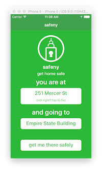

 Safeny
===================================
[See this project on Devpost.](http://devpost.com/software/safeny)
---------------------------------------------------------------------

Safeny is an app that was submitted to [HackNY's Spring 2016 Student Hackathon](http://hackny-s2016.devpost.com/). Using OpenNYC data sets, we parse crime statistics to find which areas in the city are safer than others. Then we get straightforward directions from your location to your destination using the safest routes possible for walking. [The fancy backend for this is here.](https://github.com/sayalvarun/SafeStreet)

What this app itself does is use iOS's location manager with Google Places to guess your current location, and then allows you to select a location to where you're going, and queries the backend with those locations to try and figure out the safest route in NYC to get to your destination. The app then displays the map using the Google Maps iOS SDK and draws a polyfill from where you are to your destination, and displays your current position as the typical Google blue dot.

Here's some pics:

